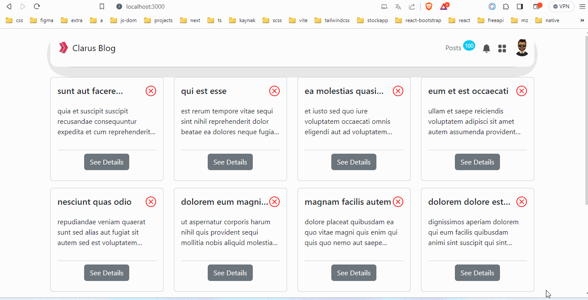

<p>Clarusway</p>

# Clarus Blog

## Description

Project aims to create a Clarus Blog App.

## Problem Statement

- We are adding a new project to our portfolios. So you and your colleagues have started to work on the project.

## Project Skeleton

```
Clarus Blog (folder)
|
|----readme.md         # Given to the students (Definition of the project)
├── public
│     └── index.html
├──📦src
│   ┣ 📂assets
│   ┃ ┣ 📜about.png
│   ┃ ┗ 📜Clarusway_Logo.png
│   ┣ 📂components
│   ┃ ┣ 📜BlogCard.jsx
│   ┃ ┣ 📜MyModal.jsx
│   ┃ ┗ 📜MyNavbar.jsx
│   ┣ 📂pages
│   ┃ ┗ 📜Main.jsx
│   ┣ 📜App.css
│   ┣ 📜App.js
│   ┗ 📜index.js
├── package.json
└── package-lock.json

```

## Expected Outcome



## Objective

Build a Clarus Blog App using ReactJS.

### At the end of the project, following topics are to be covered;

- HTML

- CSS

- JS

- ReactJS

### At the end of the project, students will be able to;

- improve coding skills within HTML & CSS & JS & ReactJS.

- use git commands (push, pull, commit, add etc.) and Github as Version Control System.

## Steps to Solution

- Step 1: Create React App using `npx create-react-app clarus-blog`

- Step 2: Build Clarus Blog App.
- 
- Step 3: You can use https://jsonplaceholder.typicode.com/posts for data.

- Step 4: Push your application into your own public repo on Github

- Step 5: Add project gif to your project and README.md file.

## Notes

- You can add additional functionalitiesto your app.

## Demo 

[Clarus Blog](https://ass7-flame.vercel.app/)