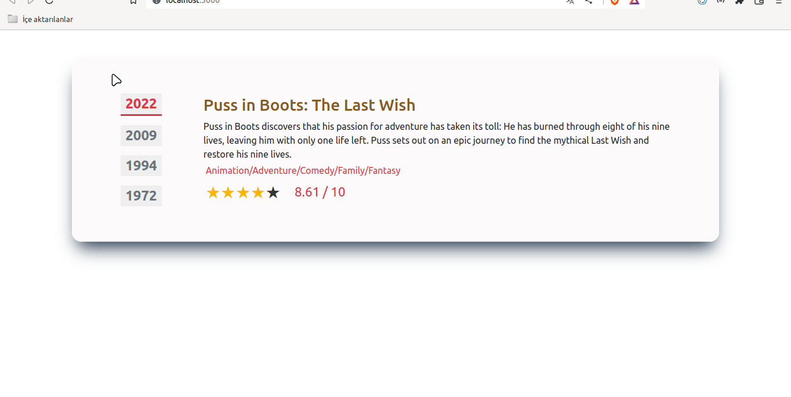

<p>Clarusway</p>

# Film Info

## Description

Project aims to create a Film Info App.

## Problem Statement

- We are adding a new project to our portfolios. So you and your colleagues have started to work on the project.

## Project Skeleton

```
Film Info (folder)
        # Given to the students (Definition of the project)
SOLUTION
├── package.json
├── public
│   └── index.html
├── README.md
├── src
│   ├── App.css
│   ├── App.js
│   ├── components
│   │   ├── FilmInfo.jsx
│   │   └── FilmYear.jsx
│   ├── helper
│   │   └── data.js
│   ├── index.js
│   └── pages
│       └── Main.jsx
└── yarn.lock

```

## Expected Outcome



## Objective

Build a film Info App using ReactJS.

### At the end of the project, following topics are to be covered;

- HTML

- CSS

- JS

- ReactJS

### At the end of the project, students will be able to;

- improve coding skills within HTML & CSS & JS & ReactJS.

- use git commands (push, pull, commit, add etc.) and Github as Version Control System.

## Steps to Solution

- Step 1: Create React App using `npx create-react-app film-info`.

- Step 2: Build Film Info App.

- Step 3: Push your application into your own public repo on Github

- Step 4: Add project gif to your project and README.md file.

## Notes

- You can use `react-simple-star-rating` package for star rating or different package or custom styling. <a href="https://www.npmjs.com/package/react-simple-star-rating">Click</a>

## Demo
  <a href="https://film-info-project.vercel.app/" target="_blank">React Film Info</a>

**<p align="center">&#9786; Happy Coding &#9997;</p>**
