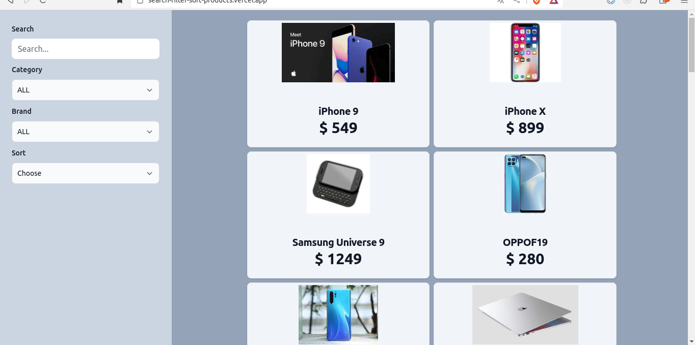

<p>Clarusway</p>

# Search-Filter-Sort Projects

## Description

Project aims to create a Search-Filter-Sort Projects App.

## Problem Statement

- We are adding a new project to our portfolios. So you and your colleagues have started to work on the project.

## Project Skeleton

```
Search-Filter-Sort Projects (folder)
|
|----readme.md         # Given to the students (Definition of the project)
SOLUTION
├── package.json
├── public
│   ├── favicon.ico
│   └── index.html
├── README.md
├── src
│   ├── App.js
│   ├── components
│   │   ├── Card.jsx
│   │   ├── CardModal.jsx
│   │   └── Sidebar.jsx
│   ├── index.css
│   ├── index.js
│   └── pages
│       └── Home.jsx
├── tailwind.config.js
└── yarn.lock

```

## Expected Outcome



## Objective

Build a Search-Filter-Sort App using ReactJS.

### At the end of the project, following topics are to be covered;

- HTML

- CSS/TailwindCss

- JS

- ReactJS

### At the end of the project, students will be able to;

- improve coding skills within HTML & CSS/TailwindCss & JS & ReactJS.

- use git commands (push, pull, commit, add etc.) and Github as Version Control System.

## Steps to Solution

- Step 1: Create React App using `npx create-react-app search-filter-sort`

- Step 2 : You can use `react-slick` package for slider. [Preview Document](https://react-slick.neostack.com/)

- Step 3: Build Search-Filter-Sort Projects.

- Step 4: You can use CSS frameworks like Bootstrap,TailwindCss, Material UI etc.

- Step 5: Push your application into your own public repo on Github

- Step 6: Add project gif to your project and README.md file.

## Notes

- You can use https://dummyjson.com/docs/products for data.

## Demo
  <a href="https://search-filter-sort-products.vercel.app/" target="_blank">Search-Filter-Sort Projects</a>


**<p align="center">&#9786; Happy Coding &#9997;</p>**
