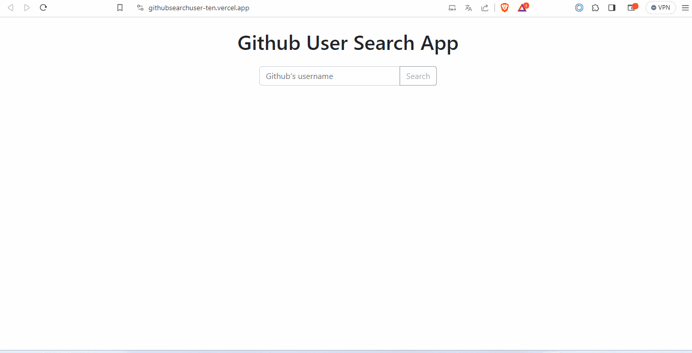

# Api Adresi

Url => https://api.github.com/users/{username} 

# İsterler:

- Butona tıklanıldığında kullanıcının inputa girdiği değere göre verilen api adresine istek atılması.
- İnput boşken istek atılmaması.
- Eğer github kullanıcısı varsa onun resmi,kullanıcı adı ve github hesabının linkinin gösterilmesi. Bunun için hazır html yapısı var. Örnek istek => https://api.github.com/users/anthonyharold67
- Eğer github kullanıcısı yoksa sayfada notFound resminin gösterilmesi gerekir. Örnek istek => https://api.github.com/users/asdasdasdaffgafada

# Örrnek Uygulama

https://githubsearchuser-ten.vercel.app/

# Beklenen
